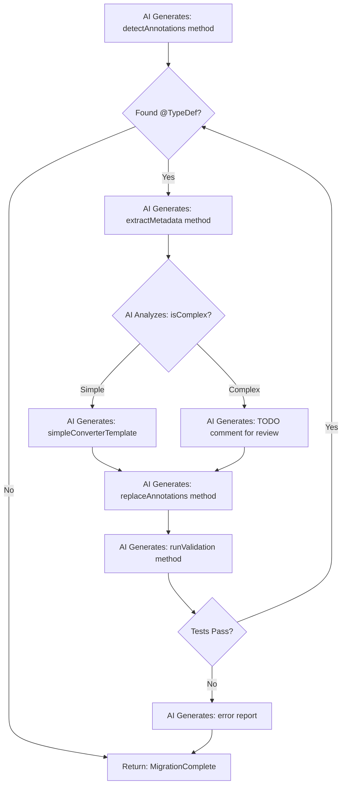

# AI Migration Tool Review: Spring Boot & Java Migration Documentation

## Executive Summary

This document reviews the Spring Boot 2.1→2.5 and Java 8→17 migration guides from the perspective of **using AI to write migration tool code** based on the [Antikythera framework](https://github.com/Cloud-Solutions-International/antikythera).

**Critical Distinction**: 
- ❌ **NOT**: AI directly performing code migrations
- ✅ **YES**: AI writing Java tool classes that perform migrations

**Purpose**: The migration guides serve as specifications for AI agents to **generate complete migration tool implementations**. AI writes Antikythera-based Java classes (e.g., `SpringBoot21To22Migrator.java`), and those generated tools then automate the actual code migrations.

**Migration Sequence**: The tools must be generated and executed in this order:
1. Spring Boot 2.1 → 2.2
2. Spring Boot 2.2 → 2.3
3. Spring Boot 2.3 → 2.4
4. Spring Boot 2.4 → 2.5
5. Java 8 → Java 17 (requires Spring Boot 2.5+)

**Overall Assessment**: The migration documentation is comprehensive and provides excellent detail for manual migrations. However, to enable AI agents to generate effective migration tool code, several enhancements would significantly improve the specifications.

---

## How AI Tool Generation Works

This section clarifies the workflow to avoid any confusion:

### Step 1: AI Reads Migration Guide
- AI agent reads migration documentation (e.g., `spring_boot_2.1_to_2.2_migration.md`)
- Extracts patterns, detection strategies, and transformation rules
- Parses YAML metadata blocks (to be added per recommendations)

### Step 2: AI Writes Tool Code
- AI generates a Java class (e.g., `SpringBoot21To22Migrator.java`)
- Implements detection methods using JavaParser
- Implements transformation methods using Antikythera APIs
- Implements validation methods for verification
- Output: Complete, compilable Java source code

### Step 3: Generated Tool Runs Migration
- Developer compiles the AI-generated Java tool
- Developer runs the tool on their project
- Tool uses Antikythera framework to:
  - Scan source code
  - Detect patterns requiring migration
  - Apply transformations
  - Validate results

**Key Point**: The AI's job is to **write the tool code**. The tool's job is to **perform the migration**.

---

## Document Inventory

| Document | Lines | Focus Area | Automation Coverage |
|----------|-------|------------|---------------------|
| `spring_boot_2.1_to_2.2_migration.md` | 3,022 | Hibernate, Kafka, JUnit, JMX | Medium |
| `spring_boot_2.2_to_2.3_migration.md` | 2,720 | Validation starter, Cloud Native, Cassandra | Medium |
| `spring_boot_2.3_to_2.4_migration.md` | 1,065 | Config processing, JUnit Vintage, Neo4j | Low |
| `spring_boot_2.4_to_2.5_migration.md` | 814 | SQL scripts, Groovy 3.x, Actuator security | Low |
| `java_8_to_17_migration_plan.md` | 800 | JVM modules, removed APIs, dependencies | Medium |

---

## Strengths for AI Tool Generation

### 1. Code Pattern Examples ✅
Each guide provides "Before/After" code snippets that serve as excellent specifications for AI agents to generate migration tool code:

```java
// Pattern clearly shows transformation
// Before (Spring Boot 2.1)
@TypeDef(name = "json", typeClass = JsonStringType.class)

// After (Spring Boot 2.2)  
@Converter
public class JsonAttributeConverter implements AttributeConverter<...>
```

**For AI Tool Generation**: These examples allow an AI agent to generate JavaParser-based detection code and AST transformation rules for an Antikythera migration tool.

### 2. Detection Strategies 📍
Several sections include explicit detection patterns:

```java
// AST Detection on class level
@TypeDef(name = "json", typeClass = JsonStringType.class)

// Automation Strategy:
// 1. Scan for @TypeDef annotations on classes
// 2. Extract: name attribute, typeClass attribute
```

**For AI Tool Generation**: These strategies allow an AI agent to generate code that uses Antikythera's `ConfigProcessor` and `Evaluator` for annotation scanning.

### 3. Dependency Analysis 📦
Clear dependency version matrices help AI agents generate version resolution code:

| Dependency | Spring Boot 2.1 | Spring Boot 2.2 |
|-----------|-----------------|-----------------|
| Hibernate | 5.3.x | 5.4.x |
| Mockito | 2.x → 3.1.0 | Breaking change |

**For AI Tool Generation**: AI can generate POM parsing and version comparison logic based on these specifications.

---

## Gaps for AI Tool Generation

### 1. Missing: Structured Automation Metadata ⚠️

**Problem**: Automation sections are embedded in narrative text, making it difficult for AI agents to parse specifications and generate tool code.

**Recommendation**: Add YAML front matter or structured sections that AI agents can parse to generate migration tool code:

```yaml
---
migration_rule:
  id: "SB22_HIBERNATE_TYPEDEF_REMOVAL"
  priority: "HIGH"
  breaking_change: true
  detection:
    annotation: "@TypeDef"
    import: "org.hibernate.annotations.TypeDef"
  transformation:
    type: "CODE_GENERATION"
    complexity: "HIGH"
    template: "AttributeConverter"
  validation:
    - "Compilation succeeds"
    - "Existing tests pass"
  antikythera_tools:
    - "JavaParser AST scanning"
    - "Evaluator for annotation extraction"
    - "Generator for converter creation"
---
```

### 2. Incomplete: Cross-Document Dependencies 🔗

**Problem**: Java 17 migration requires Spring Boot 2.5+, but this dependency is only mentioned narratively, making it hard for AI agents to generate proper sequencing logic.

**Recommendation**: Add dependency graph section that AI agents can use to generate migration orchestration code:

```
java_8_to_17_migration_plan.md
  ├── REQUIRES: spring_boot_2.4_to_2.5_migration.md
  │   └── REQUIRES: spring_boot_2.3_to_2.4_migration.md
  │       └── REQUIRES: spring_boot_2.2_to_2.3_migration.md
  │           └── REQUIRES: spring_boot_2.1_to_2.2_migration.md
```

**For AI Tool Generation**: AI agents can generate code to check prerequisites and sequence migrations correctly.

### 3. Missing: Confidence Scores 📊

**Problem**: Some migrations are mechanical (HIGH confidence), others require human judgment (LOW confidence).

**Current State**: Only mentioned sporadically (e.g., "Automation Confidence: 40%").

**Recommendation**: Add to every migration pattern:

```yaml
confidence_metrics:
  detection_accuracy: 95%  # How reliably can we find the pattern?
  transformation_safety: 85%  # How safe is automated transformation?
  validation_coverage: 70%  # Can we verify correctness automatically?
  requires_human_review: false
```

### 4. Insufficient: Edge Case Documentation 🚧

**Problem**: Most examples show "happy path" transformations.

**Example from Hibernate @TypeDef migration**:
- Shows simple `Map<String, Object>` case
- Missing: Generic types, custom serializers, null handling, nested objects

**Recommendation**: Add edge case section:

```markdown
### Edge Cases for Automation

#### Case 1: Generic Type Parameters
```java
// Complex case
@Type(type = "json")  
private List<Map<String, CustomObject>> complexData;

// Generator must handle:
// - TypeReference creation for nested generics
// - Custom ObjectMapper configuration
```

#### Case 2: Null Value Handling
```java
// Must preserve null semantics
@Type(type = "json")
@Column(nullable = true)
private Map<String, Object> attributes;
```

**Automation Strategy**: Generate with TODO markers for human review
```

### 5. Missing: Test Case Patterns 🧪

**Problem**: Guides don't show how to validate migrations programmatically.

**Recommendation**: Add verification sections:

```java
// Test pattern for Hibernate @TypeDef → @Converter migration
@Test
public void validateTypeDefMigration() {
    // 1. Parse original file
    CompilationUnit original = JavaParser.parse(originalFile);
    
    // 2. Apply migration
    Migrator migrator = new HibernateTypeDefMigrator();
    CompilationUnit migrated = migrator.apply(original);
    
    // 3. Verify transformations
    assertTrue(migrated.findAll(AnnotationExpr.class, 
        a -> a.getNameAsString().equals("TypeDef")).isEmpty());
    
    assertTrue(migrated.findAll(ClassOrInterfaceDeclaration.class)
        .stream().anyMatch(c -> c.getNameAsString().endsWith("Converter")));
    
    // 4. Compile and run tests
    CompilationResult result = compile(migrated);
    assertTrue(result.isSuccess());
}
```

---

## Antikythera Integration Opportunities

### 1. Leverage Existing Antikythera Capabilities ✨

#### Query Optimization Pattern → Migration Tool Pattern
The `QueryOptimizer` tool demonstrates the pattern that AI agents should replicate when generating migration tools:

```java
// Existing pattern: Query optimization tool
1. Scan repositories with JavaParser
2. Extract @Query annotations
3. Use AI to optimize queries
4. Apply changes with LexicalPreservingPrinter
5. Update method call sites

// AI agent should generate: Migration tool following same pattern
1. Scan entities with JavaParser
2. Extract @TypeDef/@Type annotations  
3. Generate AttributeConverter classes
4. Apply changes with LexicalPreservingPrinter
5. Update entity references
```

**Key Insight**: AI agents can study QueryOptimizer as a template and generate similar migration tools using the patterns described in the migration docs.

#### Fields.java Usage Analysis
```java
// Existing: Track repository usage across codebase
// AI-generated migration tool should use similar pattern: Track @TypeDef usage
Fields fields = new Fields();
Map<String, List<String>> typeDefUsage = fields.findAnnotationUsage("@TypeDef");
```

### 2. Specification Format for AI Tool Generation 🤖

The migration guides should be formatted to enable AI agents to generate migration tool code. Here's how an AI agent would interpret the documentation:

```java
// AI Agent reads migration guide and generates this tool class
public class HibernateTypeDefMigrator extends BaseMigrator {
    
    /**
     * Generated based on migration guide specification:
     * "Hibernate 5.3 → 5.4 requires AttributeConverter pattern"
     */
    @Override
    public MigrationResult execute(Project project) {
        // 1. Detection (generated from guide's "Detection Strategy")
        List<TypeDefUsage> typeDefUsages = detectTypeDefAnnotations(project);
        
        // 2. Transformation (generated from guide's "Before/After" examples)
        for (TypeDefUsage usage : typeDefUsages) {
            AttributeConverterSpec spec = analyzeTypeDefUsage(usage);
            generateAttributeConverter(spec);
            replaceAnnotations(usage, spec);
        }
        
        // 3. Validation (generated from guide's "Validation" section)
        return validateMigration(project);
    }
    
    // Methods generated based on migration guide patterns...
}
```

**Recommendation**: Structure migration guides so AI agents can extract:
1. **Class skeleton** to generate (e.g., `HibernateTypeDefMigrator extends BaseMigrator`)
2. **Detection logic** from "AST Detection" sections
3. **Transformation logic** from "Before/After" code examples
4. **Validation logic** from "Verification" sections

### 3. Configuration-Driven Tool Generation 📋

Extend `generator.yml` format to guide AI agents in generating migration tools:

```yaml
# Current generator.yml structure
base_path: ${projects_folder}/my-project/
ai_service:
  provider: "gemini"
  model: "gemini-2.5-flash-lite-preview-09-2025"

# Proposed: Migration tool specifications for AI to generate code from
migration_tool_specs:
  spring_boot_2.1_to_2.2:
    generate_tool_class: "SpringBoot21To22Migrator"
    base_class: "BaseMigrator"
    rules:
      - id: "hibernate_typedef_removal"
        priority: 1
        generate_methods:
          - "detectTypeDefAnnotations()"
          - "generateAttributeConverter()"
          - "replaceTypeAnnotations()"
        source_pattern:
          annotation: "@TypeDef"
          package: "org.hibernate.annotations"
        transformation:
          type: "generate_converter"
          template_reference: "templates/AttributeConverter.java.ftl"
        validation:
          - "verifyNoTypeDefAnnotations()"
          - "verifyConvertersGenerated()"
          - "compileAndTest()"
```

**Usage**: AI agent reads this spec and generates the complete Java class `SpringBoot21To22Migrator.java` with all required methods.

### 4. Incremental Tool Generation Strategy 🎯

AI agents should generate migration tools incrementally, with checkpoints:

```java
// AI agent generates orchestrator class
public class MigrationOrchestrator {
    
    /**
     * AI-generated method that executes migration tool sequence
     */
    public MigrationResult executeMigrationSequence(MigrationPlan plan) {
        // Phase 1: Generate and run Spring Boot 2.1 → 2.2 tool
        MigrationTool step1 = new SpringBoot21To22Migrator();  // AI-generated class
        step1.execute();
        validateCheckpoint("spring_boot_2.2");
        
        // Phase 2: Generate and run Spring Boot 2.2 → 2.3 tool
        MigrationTool step2 = new SpringBoot22To23Migrator();  // AI-generated class
        step2.execute();
        validateCheckpoint("spring_boot_2.3");
        
        // Continue through chain...
    }
    
    // AI generates validation code from guide's "Validation Checklist"
    private void validateCheckpoint(String milestone) {
        boolean compiles = compileProject();
        if (!compiles) {
            throw new MigrationException("Compilation failed at " + milestone);
        }
        
        TestResults tests = runTests();
        if (tests.hasFailures()) {
            generateFailureReport(milestone, tests);
            throw new MigrationException("Tests failed at " + milestone);
        }
    }
}
```

---

## Recommended Enhancements

### Priority 1: Add AI Tool Generation Metadata 🏆

For each migration section, add structured metadata that AI agents can parse to generate migration tool code:

```markdown
#### Hibernate @TypeDef Removal

<!-- BEGIN TOOL GENERATION SPEC -->
```yaml
tool_generation:
  rule_id: "SB22_HIBERNATE_TYPEDEF"
  generated_class: "HibernateTypeDefMigrator"
  extends: "BaseMigrator"
  
  detection_method:
    name: "detectTypeDefAnnotations"
    ast_patterns:
      - "AnnotationExpr[name='TypeDef']"
      - "ImportDeclaration[name='org.hibernate.annotations.TypeDef']"
    file_patterns:
      - "src/main/java/**/*Entity.java"
    returns: "List<TypeDefUsage>"
    
  transformation_method:
    name: "generateAttributeConverter"
    type: "CODE_GENERATION"
    complexity: "HIGH"
    parameters:
      - "TypeDefUsage usage"
    antikythera_apis:
      - "JavaParser: Parse entity files"
      - "Evaluator: Extract @TypeDef metadata"  
      - "Generator: Create AttributeConverter class"
      - "LexicalPreservingPrinter: Update entity annotations"
    returns: "ConverterSpec"
    
  validation_method:
    name: "validateMigration"
    checks:
      - "Verify @TypeDef removed from entity"
      - "Verify @Convert annotation added"
      - "Verify converter class generated"
      - "Compile and run entity tests"
    returns: "MigrationResult"
```
<!-- END TOOL GENERATION SPEC -->

[Existing narrative content...]
```

**AI Agent Usage**: Parse this YAML to generate complete `HibernateTypeDefMigrator.java` class with method stubs and implementation based on the specifications.

### Priority 2: Create Tool Generation DSL 📝

Define a domain-specific language that AI agents use to generate complete migration tool classes:

```yaml
# File: tool-specs/spring_boot_2.1_to_2.2.yml
# AI agent reads this to generate SpringBoot21To22Migrator.java

tool_specification:
  class_name: "SpringBoot21To22Migrator"
  extends: "BaseMigrator"
  package: "sa.com.cloudsolutions.migration.springboot"
  
  migration_info:
    name: "Spring Boot 2.1 to 2.2"
    version_from: "2.1.x"
    version_to: "2.2.13.RELEASE"
  
  generated_methods:
    - method_name: "migrateHibernateTypeDef"
      category: "BREAKING_CHANGE"
      priority: 1
      
      detection_code:
        # AI generates this Java code
        scan_for:
          - annotation: "@TypeDef"
            import: "org.hibernate.annotations.TypeDef"
          - annotation: "@Type"
            import: "org.hibernate.annotations.Type"
        file_pattern: "**/*Entity.java"
      
      transformation_code:
        # AI generates this Java code
        strategy: "GENERATE_AND_REPLACE"
        steps:
          - action: "generate_converter_class"
            template: "AttributeConverter"
            location: "{package}/converters"
            
          - action: "replace_annotation"
            from: "@Type(type = '{name}')"
            to: "@Convert(converter = {ConverterClass}.class)"
          
          - action: "remove_annotation"
            target: "@TypeDef"
      
      validation_code:
        # AI generates this Java code
        assertions:
          - "assertNoAnnotations(project, '@TypeDef')"
          - "assertAnnotationsReplaced(project, '@Type', '@Convert')"
          - "assertConverterClassesExist(expectedConverters)"
          - "assertProjectCompiles(project)"
          - "assertTestsPass(project)"
```

**AI Agent Process**:
1. Parse this YAML specification
2. Generate Java class `SpringBoot21To22Migrator` with all methods
3. Generate detection code using JavaParser patterns
4. Generate transformation code using Antikythera Generator
5. Generate validation code with proper assertions

### Priority 3: Add Visual Diagrams for AI Code Generation 📊

Include flowcharts that show AI agents how to structure the generated migration tool logic:



**For AI Agents**: This flowchart maps to method generation in the migration tool class.

### Priority 4: Provide Reference Implementations 🎓

Add example generated code that AI agents can use as templates:

```
antikythera-examples/
├── docs/
│   ├── spring_boot_2.1_to_2.2_migration.md
│   └── ...
├── migration-tools/
│   ├── src/main/java/
│   │   └── sa/com/cloudsolutions/migration/
│   │       ├── SpringBoot21To22Migrator.java
│   │       ├── HibernateTypeDefMigrator.java
│   │       └── JUnit4To5Migrator.java
│   └── src/test/resources/
│       └── test-projects/
│           ├── before/  # Sample project with old code
│           └── after/   # Expected result after migration
```

### Priority 5: Add Validation Checklists for Generated Tools 🧪

For each migration, provide specifications that AI agents use to generate validation code:

```markdown
### Validation Checklist (AI generates validation methods from this)

#### Generated Validation Methods
```java
// AI generates these methods in the migration tool class
public boolean validateNoTypeDefAnnotations() {
    // Generated from: "No @TypeDef annotations in src/main/java/**/*.java"
    return findAnnotations(project, "@TypeDef").isEmpty();
}

public boolean validateConvertersGenerated() {
    // Generated from: "Converter classes generated in converters/ package"
    return expectedConverters.stream()
        .allMatch(c -> Files.exists(converterPath.resolve(c + ".java")));
}

public boolean validateCompilation() {
    // Generated from: "mvn clean compile succeeds"
    CompilationResult result = compileProject();
    return result.isSuccess() && result.getWarnings().isEmpty();
}

public boolean validateTests() {
    // Generated from: "mvn test passes with 0 failures"
    TestResults results = runTests();
    return results.getFailures() == 0;
}
```

#### Manual Review Flags (AI generates TODO comments)
```java
// TODO: Human review required - Verify JSON serialization behavior unchanged
// TODO: Human review required - Check database column types unchanged
// TODO: Optional - Performance testing
```
```

---

## Suggested New Documents

### 1. `docs/MIGRATION_TOOL_ARCHITECTURE.md`
Describes how AI agents should structure generated migration tools:
- Base class architecture for generated tools
- Common patterns for detection/transformation/validation
- Antikythera API usage patterns
- Testing strategies for generated tools

### 2. `docs/TOOL_GENERATION_DSL_SPEC.md`
Formal specification of the DSL for AI tool generation:
- YAML schema for tool specifications
- Method generation rules
- Code template patterns
- Validation framework specification

### 3. `docs/GENERATED_TOOL_EXAMPLES.md`
Example migration tools that AI agents can use as reference:
- Complete `HibernateTypeDefMigrator.java` generated code
- `JUnit4To5Migrator.java` generated code
- Annotations and documentation in generated code
- Test cases for generated tools

### 4. `docs/EDGE_CASES_CATALOG.md`
Comprehensive edge case documentation for AI to handle:
- Complex type hierarchies → generate TODO comments
- Multiple inheritance → flag for human review
- Reflection usage → detection patterns
- Dynamic class loading → warning generation

---

## Implementation Roadmap

### Phase 1: Documentation Enhancement (2-3 weeks)
- [ ] Add tool generation metadata to all 5 migration guides
- [ ] Create tool generation DSL specification
- [ ] Add code generation examples for AI agents
- [ ] Document Antikythera API patterns for tool generation

### Phase 2: AI Agent Development (4-6 weeks)
- [ ] Build AI agent that reads migration specs and generates tool code
- [ ] Generate `SpringBoot21To22Migrator` tool from specifications
- [ ] Generate `HibernateTypeDefMigrator` from guide patterns
- [ ] Validate generated tools against test projects

### Phase 3: Tool Enhancement (6-8 weeks)
- [ ] Add orchestration code generation for multi-step migrations
- [ ] Generate edge case detection and TODO comment insertion
- [ ] Generate interactive CLI for migration tools
- [ ] Generate comprehensive test suites for tools

### Phase 4: Production Readiness (4-6 weeks)
- [ ] Validate generated tools on real-world codebases
- [ ] Optimize generated code quality
- [ ] Complete all documentation for AI tool generation
- [ ] Gather feedback on AI-generated tools

---

## Conclusion

The existing migration documentation provides excellent manual migration guidance and contains the raw material needed for **AI agents to generate migration tools**. However, to maximize effectiveness for AI tool code generation:

### Critical Improvements:
1. ✅ Add structured tool generation metadata (YAML/JSON)
2. ✅ Define DSL for AI agents to generate tool classes
3. ✅ Provide code generation examples and templates
4. ✅ Add validation specifications for generated code
5. ✅ Build reference generated tool implementations

### Antikythera Alignment:
The migration patterns described align well with how AI agents can generate tools using Antikythera's capabilities:
- ✅ JavaParser for AST analysis → AI generates detection methods
- ✅ Evaluator for code evaluation → AI generates metadata extraction
- ✅ Generator framework for code creation → AI generates transformation logic
- ✅ Validation hooks for testing → AI generates validation methods

### Expected Outcome:
With these enhancements, AI agents can generate reliable migration tools that:
- Detect migration patterns with 90%+ accuracy (generated detection code)
- Apply safe transformations automatically (generated transformation code)
- Flag complex cases for human review (generated TODO comments)
- Validate results programmatically (generated validation methods)
- Generate comprehensive reports (generated reporting code)

---

**Next Steps**: 
1. Prioritize enhancements based on immediate AI agent development needs
2. Start with one migration guide as proof-of-concept for AI tool generation
3. Iterate on generated tool quality based on real-world testing
4. Expand AI generation capabilities to remaining guides

**Questions for @e4c5**:
- Which migration (Spring Boot or Java) should AI agents prioritize for tool generation?
- Should generated migration tools be in a new `migration-tools/` directory?
- Do you prefer YAML or JSON for the tool generation DSL?
- Should AI-generated code include extensive inline documentation?
