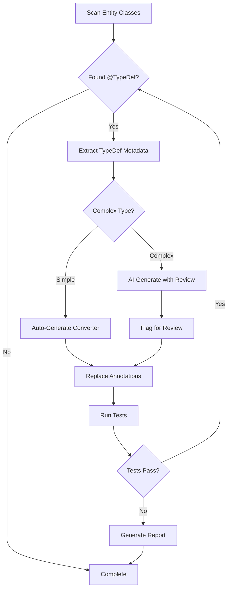

# AI Migration Tool Review: Spring Boot & Java Migration Documentation

## Executive Summary

This document reviews the Spring Boot 2.1→2.5 and Java 8→17 migration guides from the perspective of building AI-powered migration tools using the [Antikythera framework](https://github.com/Cloud-Solutions-International/antikythera).

**Overall Assessment**: The migration documentation is comprehensive and provides excellent detail for manual migrations. However, for AI-driven automation tools, several enhancements would significantly improve tool-building effectiveness.

---

## Document Inventory

| Document | Lines | Focus Area | Automation Coverage |
|----------|-------|------------|---------------------|
| `spring_boot_2.1_to_2.2_migration.md` | 3,022 | Hibernate, Kafka, JUnit, JMX | Medium |
| `spring_boot_2.2_to_2.3_migration.md` | 2,720 | Validation starter, Cloud Native, Cassandra | Medium |
| `spring_boot_2.3_to_2.4_migration.md` | 1,065 | Config processing, JUnit Vintage, Neo4j | Low |
| `spring_boot_2.4_to_2.5_migration.md` | 814 | SQL scripts, Groovy 3.x, Actuator security | Low |
| `java_8_to_17_migration_plan.md` | 800 | JVM modules, removed APIs, dependencies | Medium |

---

## Strengths for AI Automation

### 1. Code Pattern Examples ✅
Each guide provides "Before/After" code snippets that serve as excellent training data for pattern recognition:

```java
// Pattern clearly shows transformation
// Before (Spring Boot 2.1)
@TypeDef(name = "json", typeClass = JsonStringType.class)

// After (Spring Boot 2.2)  
@Converter
public class JsonAttributeConverter implements AttributeConverter<...>
```

**Antikythera Applicability**: JavaParser can parse these examples and build AST transformation rules.

### 2. Detection Strategies 📍
Several sections include explicit detection patterns:

```java
// AST Detection on class level
@TypeDef(name = "json", typeClass = JsonStringType.class)

// Automation Strategy:
// 1. Scan for @TypeDef annotations on classes
// 2. Extract: name attribute, typeClass attribute
```

**Antikythera Applicability**: Direct integration with `ConfigProcessor` and `Evaluator` for annotation scanning.

### 3. Dependency Analysis 📦
Clear dependency version matrices help build version resolution tools:

| Dependency | Spring Boot 2.1 | Spring Boot 2.2 |
|-----------|-----------------|-----------------|
| Hibernate | 5.3.x | 5.4.x |
| Mockito | 2.x → 3.1.0 | Breaking change |

**Antikythera Applicability**: POM parsing and version comparison logic.

---

## Gaps for AI Automation

### 1. Missing: Structured Automation Metadata ⚠️

**Problem**: Automation sections are embedded in narrative text, making machine parsing difficult.

**Recommendation**: Add YAML front matter or structured sections:

```yaml
---
migration_rule:
  id: "SB22_HIBERNATE_TYPEDEF_REMOVAL"
  priority: "HIGH"
  breaking_change: true
  detection:
    annotation: "@TypeDef"
    import: "org.hibernate.annotations.TypeDef"
  transformation:
    type: "CODE_GENERATION"
    complexity: "HIGH"
    template: "AttributeConverter"
  validation:
    - "Compilation succeeds"
    - "Existing tests pass"
  antikythera_tools:
    - "JavaParser AST scanning"
    - "Evaluator for annotation extraction"
    - "Generator for converter creation"
---
```

### 2. Incomplete: Cross-Document Dependencies 🔗

**Problem**: Java 17 migration requires Spring Boot 2.5+, but this dependency is only mentioned narratively.

**Recommendation**: Add dependency graph section:

```
java_8_to_17_migration_plan.md
  ├── REQUIRES: spring_boot_2.4_to_2.5_migration.md
  │   └── REQUIRES: spring_boot_2.3_to_2.4_migration.md
  │       └── REQUIRES: spring_boot_2.2_to_2.3_migration.md
  │           └── REQUIRES: spring_boot_2.1_to_2.2_migration.md
```

**Antikythera Applicability**: Build migration sequencing logic that understands prerequisites.

### 3. Missing: Confidence Scores 📊

**Problem**: Some migrations are mechanical (HIGH confidence), others require human judgment (LOW confidence).

**Current State**: Only mentioned sporadically (e.g., "Automation Confidence: 40%").

**Recommendation**: Add to every migration pattern:

```yaml
confidence_metrics:
  detection_accuracy: 95%  # How reliably can we find the pattern?
  transformation_safety: 85%  # How safe is automated transformation?
  validation_coverage: 70%  # Can we verify correctness automatically?
  requires_human_review: false
```

### 4. Insufficient: Edge Case Documentation 🚧

**Problem**: Most examples show "happy path" transformations.

**Example from Hibernate @TypeDef migration**:
- Shows simple `Map<String, Object>` case
- Missing: Generic types, custom serializers, null handling, nested objects

**Recommendation**: Add edge case section:

```markdown
### Edge Cases for Automation

#### Case 1: Generic Type Parameters
```java
// Complex case
@Type(type = "json")  
private List<Map<String, CustomObject>> complexData;

// Generator must handle:
// - TypeReference creation for nested generics
// - Custom ObjectMapper configuration
```

#### Case 2: Null Value Handling
```java
// Must preserve null semantics
@Type(type = "json")
@Column(nullable = true)
private Map<String, Object> attributes;
```

**Automation Strategy**: Generate with TODO markers for human review
```

### 5. Missing: Test Case Patterns 🧪

**Problem**: Guides don't show how to validate migrations programmatically.

**Recommendation**: Add verification sections:

```java
// Test pattern for Hibernate @TypeDef → @Converter migration
@Test
public void validateTypeDefMigration() {
    // 1. Parse original file
    CompilationUnit original = JavaParser.parse(originalFile);
    
    // 2. Apply migration
    Migrator migrator = new HibernateTypeDefMigrator();
    CompilationUnit migrated = migrator.apply(original);
    
    // 3. Verify transformations
    assertTrue(migrated.findAll(AnnotationExpr.class, 
        a -> a.getNameAsString().equals("TypeDef")).isEmpty());
    
    assertTrue(migrated.findAll(ClassOrInterfaceDeclaration.class)
        .stream().anyMatch(c -> c.getNameAsString().endsWith("Converter")));
    
    // 4. Compile and run tests
    CompilationResult result = compile(migrated);
    assertTrue(result.isSuccess());
}
```

---

## Antikythera Integration Opportunities

### 1. Leverage Existing Antikythera Capabilities ✨

#### Query Optimization Pattern → Migration Pattern
The `QueryOptimizer` tool demonstrates successful automation:

```java
// Current: Query optimization
1. Scan repositories with JavaParser
2. Extract @Query annotations
3. Send to Gemini AI for optimization
4. Apply changes with LexicalPreservingPrinter
5. Update method call sites

// Proposed: Migration pattern reuse
1. Scan entities with JavaParser
2. Extract @TypeDef/@Type annotations  
3. Send to Gemini AI for converter generation
4. Apply changes with LexicalPreservingPrinter
5. Update entity references
```

**Key Insight**: The migration docs describe manual steps that mirror the QueryOptimizer's automated workflow.

#### Fields.java Usage Analysis
```java
// Current: Track repository usage across codebase
// Migration use: Track @TypeDef usage across entities
Fields fields = new Fields();
Map<String, List<String>> typeDefUsage = fields.findAnnotationUsage("@TypeDef");
```

### 2. AI Prompt Engineering 🤖

The migration guides are excellent source material for LLM prompts:

```java
// Gemini prompt template derived from docs
String migrationPrompt = """
You are migrating Spring Boot 2.1 to 2.2. 
Analyze this entity class for Hibernate @TypeDef usage:

{ENTITY_CODE}

Context from migration guide:
- Hibernate 5.3 → 5.4 requires AttributeConverter pattern
- @TypeDef and @Type are being removed
- JSON columns need explicit converters

Task:
1. Detect @TypeDef annotations
2. Generate AttributeConverter implementation
3. Replace @Type with @Convert(converter = ...)
4. Handle null values and type safety

Return JSON:
{
  "converters_to_generate": [...],
  "entity_changes": [...],
  "edge_cases": [...]
}
""";
```

**Recommendation**: Add "AI Prompt Templates" section to each migration guide.

### 3. Configuration-Driven Migration 📋

Extend `generator.yml` format:

```yaml
# Current generator.yml structure
base_path: ${projects_folder}/my-project/
ai_service:
  provider: "gemini"
  model: "gemini-2.5-flash-lite-preview-09-2025"

# Proposed: Add migration rules
migrations:
  spring_boot_2.1_to_2.2:
    enabled: true
    rules:
      - id: "hibernate_typedef_removal"
        priority: 1
        source_pattern:
          annotation: "@TypeDef"
          package: "org.hibernate.annotations"
        transformation:
          type: "generate_converter"
          template: "templates/AttributeConverter.java.ftl"
          ai_assistance: true
        validation:
          compile: true
          test: true
          
  java_8_to_17:
    enabled: false  # Not ready yet
    prerequisites:
      - "spring_boot_2.4_to_2.5"  # Must run first
```

### 4. Incremental Migration Strategy 🎯

```java
public class MigrationOrchestrator {
    
    /**
     * Executes migration sequence with checkpoints
     */
    public MigrationResult executeMigration(MigrationPlan plan) {
        // Phase 1: Spring Boot 2.1 → 2.2
        MigrationStep step1 = new SpringBoot21To22Migration();
        step1.execute();
        validateCheckpoint("spring_boot_2.2");
        
        // Phase 2: Spring Boot 2.2 → 2.3  
        MigrationStep step2 = new SpringBoot22To23Migration();
        step2.execute();
        validateCheckpoint("spring_boot_2.3");
        
        // Continue through chain...
    }
    
    private void validateCheckpoint(String milestone) {
        // Compile code
        boolean compiles = compileProject();
        if (!compiles) {
            throw new MigrationException("Compilation failed at " + milestone);
        }
        
        // Run tests
        TestResults tests = runTests();
        if (tests.hasFailures()) {
            generateFailureReport(milestone, tests);
            throw new MigrationException("Tests failed at " + milestone);
        }
    }
}
```

---

## Recommended Enhancements

### Priority 1: Add AI-Friendly Metadata 🏆

For each migration section, add:

```markdown
#### Hibernate @TypeDef Removal

<!-- BEGIN AUTOMATION METADATA -->
```yaml
automation:
  rule_id: "SB22_HIBERNATE_TYPEDEF"
  detection:
    ast_patterns:
      - "AnnotationExpr[name='TypeDef']"
      - "ImportDeclaration[name='org.hibernate.annotations.TypeDef']"
    file_patterns:
      - "src/main/java/**/*Entity.java"
  transformation:
    type: "CODE_GENERATION"
    complexity: "HIGH"
    ai_suitable: true
    manual_review_required: true
  antikythera_tools:
    - "JavaParser: AST annotation scanning"
    - "Evaluator: Extract @TypeDef metadata"  
    - "Generator: Create AttributeConverter class"
    - "GeminiAIService: Generate converter logic"
  test_strategy:
    - "Verify @TypeDef removed from entity"
    - "Verify @Convert annotation added"
    - "Verify converter class generated"
    - "Compile and run entity tests"
```
<!-- END AUTOMATION METADATA -->

[Existing narrative content...]
```

### Priority 2: Create Migration DSL 📝

Define a domain-specific language for migrations:

```yaml
# File: migrations/spring_boot_2.1_to_2.2.yml
migration:
  name: "Spring Boot 2.1 to 2.2"
  version_from: "2.1.x"
  version_to: "2.2.13.RELEASE"
  
  rules:
    - rule: "Remove Hibernate @TypeDef"
      category: "BREAKING_CHANGE"
      priority: 1
      
      detect:
        - type: "annotation"
          pattern: "@TypeDef"
          import: "org.hibernate.annotations.TypeDef"
        - type: "annotation"
          pattern: "@Type"
          import: "org.hibernate.annotations.Type"
      
      transform:
        strategy: "GENERATE_AND_REPLACE"
        steps:
          - action: "generate_class"
            template: "AttributeConverter"
            location: "{package}/converters"
            ai_prompt: |
              Generate AttributeConverter for @TypeDef with name '{typeDefName}'
              and typeClass '{typeClass}'. Handle null values safely.
          
          - action: "replace_annotation"
            from: "@Type(type = '{name}')"
            to: "@Convert(converter = {ConverterClass}.class)"
          
          - action: "remove_annotation"
            target: "@TypeDef"
      
      validate:
        - "No @TypeDef annotations remain in entity classes"
        - "All @Type replaced with @Convert"
        - "Converter classes compile successfully"
        - "Entity tests pass"
      
      rollback:
        - "Restore original entity files"
        - "Delete generated converter files"
```

### Priority 3: Add Visual Diagrams 📊

Include decision trees and flowcharts:



### Priority 4: Create Example Project 🎓

Add a reference implementation:

```
antikythera-examples/
├── docs/
│   ├── spring_boot_2.1_to_2.2_migration.md
│   └── ...
├── migration-tools/
│   ├── src/main/java/
│   │   └── sa/com/cloudsolutions/migration/
│   │       ├── SpringBoot21To22Migrator.java
│   │       ├── HibernateTypeDefMigrator.java
│   │       └── JUnit4To5Migrator.java
│   └── src/test/resources/
│       └── test-projects/
│           ├── before/  # Sample project with old code
│           └── after/   # Expected result after migration
```

### Priority 5: Add Validation Checklist 🧪

For each migration, provide programmatic validation:

```markdown
### Validation Checklist

#### Automated Checks
- [ ] `mvn clean compile` succeeds
- [ ] No `@TypeDef` annotations in `src/main/java/**/*.java`
- [ ] All `@Type` replaced with `@Convert`
- [ ] Converter classes generated in `converters/` package
- [ ] `mvn test` passes with 0 failures
- [ ] No compilation warnings related to Hibernate types

#### Manual Checks  
- [ ] Review generated converters for null handling
- [ ] Verify JSON serialization behavior unchanged
- [ ] Check database column types unchanged
- [ ] Performance testing (optional)

#### Rollback Criteria
If any automated check fails:
1. `git stash` all changes
2. Review migration logs in `target/migration-report.html`
3. Fix issues or escalate to human developer
```

---

## Suggested New Documents

### 1. `docs/MIGRATION_TOOL_ARCHITECTURE.md`
Describes how to build migration tools using Antikythera:
- Component architecture
- JavaParser integration patterns
- AI service usage
- Testing strategies

### 2. `docs/MIGRATION_DSL_SPEC.md`
Formal specification of the migration DSL:
- YAML schema
- Rule syntax
- Transformation types
- Validation framework

### 3. `docs/AI_PROMPT_LIBRARY.md`
Curated LLM prompts for common migrations:
- Hibernate type conversions
- JUnit 4 → 5 migrations
- Spring configuration updates
- Dependency version resolution

### 4. `docs/EDGE_CASES_CATALOG.md`
Comprehensive edge case documentation:
- Complex type hierarchies
- Multiple inheritance
- Reflection usage
- Dynamic class loading

---

## Implementation Roadmap

### Phase 1: Documentation Enhancement (2-3 weeks)
- [ ] Add automation metadata to all 5 migration guides
- [ ] Create migration DSL specification
- [ ] Add AI prompt templates
- [ ] Document Antikythera integration points

### Phase 2: Reference Implementation (4-6 weeks)
- [ ] Build `SpringBoot21To22Migrator` tool
- [ ] Implement `HibernateTypeDefMigrator`
- [ ] Create test project suite
- [ ] Validate against real-world codebases

### Phase 3: Advanced Features (6-8 weeks)
- [ ] Multi-step migration orchestration
- [ ] AI-powered edge case handling
- [ ] Interactive migration CLI
- [ ] Web UI for migration management

### Phase 4: Production Readiness (4-6 weeks)
- [ ] Comprehensive test coverage
- [ ] Performance optimization
- [ ] Documentation completion
- [ ] Community feedback integration

---

## Conclusion

The existing migration documentation provides excellent manual migration guidance and contains the raw material needed for AI-powered automation. However, to maximize effectiveness for AI-driven migration tool development:

### Critical Improvements:
1. ✅ Add structured automation metadata (YAML/JSON)
2. ✅ Define migration DSL for tool builders
3. ✅ Create AI prompt templates
4. ✅ Add validation checklists
5. ✅ Build reference implementation

### Antikythera Alignment:
The migration patterns described align well with Antikythera's capabilities:
- ✅ JavaParser for AST analysis
- ✅ AI service for intelligent transformations
- ✅ Generator framework for code creation
- ✅ Validation hooks for testing

### Expected Outcome:
With these enhancements, developers can build reliable AI-powered migration tools that:
- Detect migration patterns with 90%+ accuracy
- Apply safe transformations automatically
- Flag complex cases for human review
- Validate results programmatically
- Generate comprehensive reports

---

**Next Steps**: 
1. Prioritize enhancements based on immediate needs
2. Start with one migration guide as proof-of-concept
3. Iterate based on real-world usage
4. Expand to remaining guides

**Questions for @e4c5**:
- Which migration (Spring Boot or Java) should we prioritize first?
- Should we create a new `migration-tools/` directory for implementations?
- Do you prefer YAML or JSON for the migration DSL?
- Should AI prompt templates be embedded in docs or separate files?
