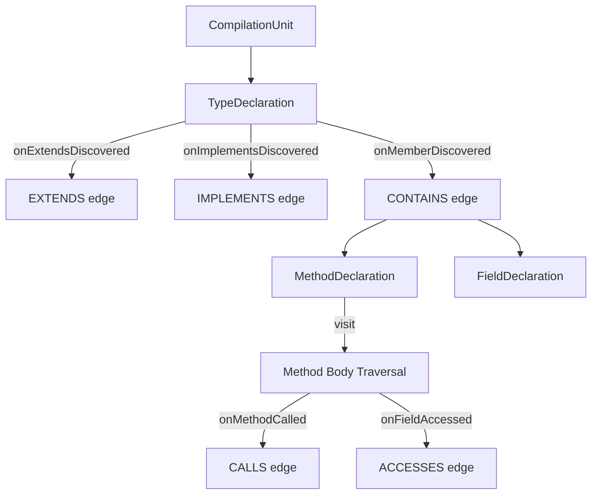

# Implementation Plan: Knowledge Graph Structural & Behavioral Fixes

This plan outlines the steps required to evolve the Antikythera Knowledge Graph from a behavioral prototype to a complete structural representation of a codebase.

## 1. Goal
Address the missing structural relationships (`CONTAINS`, `EXTENDS`, `IMPLEMENTS`), improve the accuracy of behavioral relationships (`CALLS`, `ACCESSES`), and ensure full support for **Enums**, **Lambdas**, and **Functional Programming** (Method References, Streams).

## 2. Proposed Changes

### Component: `antikythera-examples`

#### [MODIFY] [KnowledgeGraphBuilder.java](file:///home/raditha/csi/Antikythera/antikythera-examples/src/main/java/com/raditha/graph/KnowledgeGraphBuilder.java)

1.  **Broaden Entry Point**:
    *   Deprecate/Remove `build(Collection<MethodDeclaration> methods)`.
    *   Implement `build(List<CompilationUnit> units)`. This allows the builder to see the entire file structure.
    *   Iterate through all `TypeDeclaration`s in each `CompilationUnit` to trigger structural analysis.

2.  **Enhance `GraphVisitor`**:
    *   Update the internal `GraphVisitor` to handle `ClassOrInterfaceDeclaration`.
    *   In `visit(ClassOrInterfaceDeclaration, GraphNode)`, trigger:
        *   `onExtendsDiscovered` for each extended type.
        *   `onImplementsDiscovered` for each implemented type.
        *   `onMemberDiscovered` for every member (Fields, Methods, Static Blocks).
    *   Add `visit(FieldDeclaration, GraphNode)` to ensure fields are recorded as nodes and their initializers are analyzed.

3.  **Fix Behavioral Resolution Logic**:
    *   **Method Calls (`onMethodCalled`)**: 
        *   Improve the logic to resolve the `targetId`. 
        *   If `mce.getScope()` is present, use `AbstractCompiler.findType` or the `names` map in `DependencyAnalyzer` to resolve the scope's type rather than just using `scope.toString()`.
    *   **Field Access (`resolveFieldSignature`)**:
        *   Similarly, resolve the scope of the `FieldAccessExpr` to a concrete type name.

4.  **Enum Support**:
    *   Add `visit(EnumDeclaration, GraphNode)` to `GraphVisitor`.
    *   Handle enum constants as members (using `onMemberDiscovered`).
    *   Ensure enum signatures are correctly handled (using `SignatureUtils`).

5.  **Lambda Attribution**:
    *   Instead of "flattening" lambda behavior into the enclosing method, create a virtual `GraphNode` for the lambda.
    *   Ensure `onMethodCalled` and `onFieldAccessed` inside a lambda use the lambda's signature as the `sourceId`.

6.  **Functional Programming (Method References)**:
    *   Add `visit(MethodReferenceExpr, GraphNode)` to `GraphVisitor`.
    *   Resolve the target method of the reference using `Resolver.resolveMethodReference`.
    *   Create a `CALLS` edge (or a new `REFERENCES` edge) from the current scope to the target method.
    *   Ensure that method references used as parameters (common in Streams) are correctly attributed.

7.  **Wire Up Structural Hooks**:
    *   Ensure that when `onMemberDiscovered` is called, it correctly handles different member types (`FieldDeclaration`, `InitializerDeclaration`).
    *   Ensure `CONTAINS` edges are created from the class to all its members.

#### [MODIFY] [KnowledgeGraphCLI.java](file:///home/raditha/csi/Antikythera/antikythera-examples/src/main/java/com/raditha/graph/KnowledgeGraphCLI.java)

*   Update `run()` to collect `CompilationUnit`s from `AntikytheraRunTime.getResolvedCompilationUnits().values()`.
*   Pass the list of `CompilationUnit`s to the new `builder.build()` method.

#### [MODIFY] [SignatureUtils.java](file:///home/raditha/csi/Antikythera/antikythera-examples/src/main/java/com/raditha/graph/SignatureUtils.java)

*   Ensure `getSignature` correctly handles `TypeDeclaration` (it currently does, but verify it works for both top-level and nested types).

## 3. Detailed Logic Refactoring (The "Meat" of the fix)

### Structural Traversal Workflow

### Improved Target Resolution for `onMethodCalled`
Currently: `targetId = mce.getScope().get().toString() + "#" + mce.getNameAsString() + "()";`
This fails for `other.doSomething()` where `other` is an instance.
**Required Fix**:
1. Check `names` map in `DependencyAnalyzer` for the variable name.
2. If found, use the resolved `Type`.
3. If not found, try `AbstractCompiler.findType` on the scope string.

## 4. Verification Plan

### Automated Tests
1.  **Structural Integrity Test**: Create a new test case in `KnowledgeGraphIntegrationTest` that validates:
    *   A class node has `EXTENDS` and `IMPLEMENTS` edges.
    *   A class node has `CONTAINS` edges to its fields and methods.
2.  **Regression Test**: Run `KnowledgeGraphBuilderBugReproductionTest` and ensure that the failing tests (`testQualifiedMethodCall`, `testInstanceMethodCall`) now pass.
3.  **End-to-End**: Run the `KnowledgeGraphCLI` against the `test-bed` project and verify the edge count (expecting a significant increase due to structural edges).

### Manual Verification
*   Inspect a subset of the generated graph in Neo4j (using `MATCH (n)-[r]->(m) RETURN n,r,m LIMIT 100`) to visually confirm connectivity.
